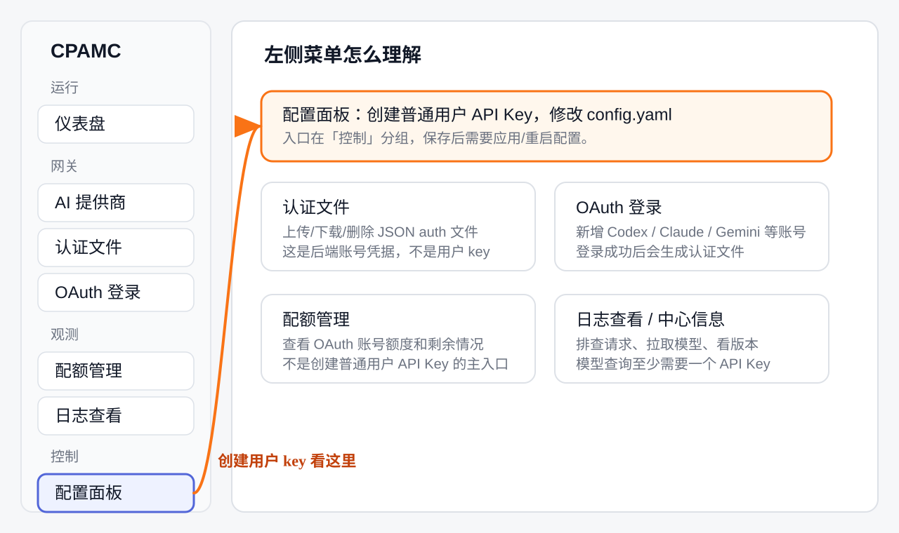
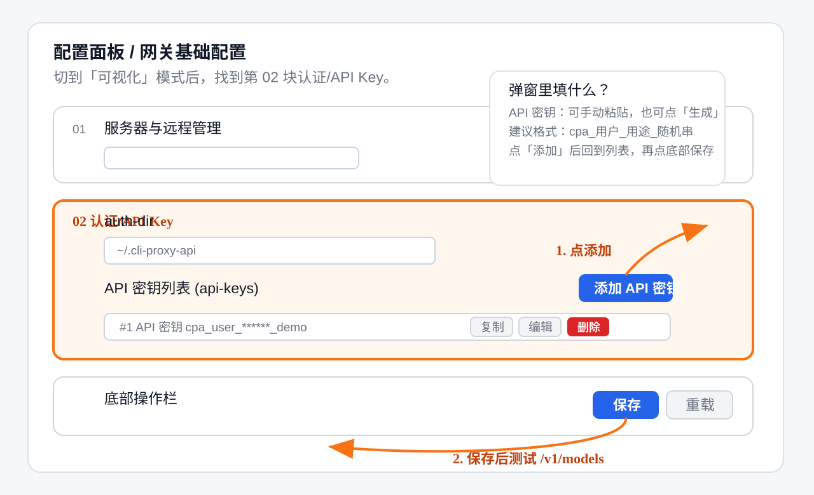

# 从 sub2api 切到 CPA 的部署和使用指南

这份文档面向已经用过 `sub2api`、准备再部署一套 `CPA / CLIProxyAPI` 的场景。重点不是把 CPA 当成另一个 sub2api 复刻版，而是说明它们的管理方式、用户接入、账号导入和日常运维有哪些不同。

本文里的示例域名使用：

```text
CPA 主服务：https://cat.cpa.boji1334.com
CPA 内置管理面板：https://cat.cpa.boji1334.com/management.html
CPA Manager Plus：https://manager.cpa.boji1334.com/management.html
OpenAI 兼容入口：https://cat.cpa.boji1334.com/v1
```

真实密钥不要写进公开 README、GitHub issue、聊天截图或用户文档。需要给用户的只应是他们自己的 API Key。

## 1. 先理解 CPA 和 sub2api 的定位差异

sub2api 更像是“面向用户订阅和分发”的服务：你会自然地想到用户、套餐、订阅链接、用户自己拿链接或 key 使用。

CPA 更像是“多账号凭据聚合 + OpenAI/Claude/Gemini/Codex 兼容代理”：核心价值是把后端登录账号、OAuth auth 文件、项目额度和模型路由集中管理，再对外暴露统一 API。

推荐你按下面的方式理解：

| 项目 | sub2api | CPA / CLIProxyAPI |
| --- | --- | --- |
| 主要用途 | 给用户分发订阅或 API 使用入口 | 聚合多个 provider 账号，统一转成兼容 API |
| 用户体系 | 通常更接近 SaaS 用户/订阅管理 | 默认不是完整用户注册系统 |
| 对外凭据 | 用户订阅/API token | `api-keys` 里的客户端 API Key |
| 后台管理 | sub2api 自身后台 | CPA 内置 `/management.html`，可选 Manager Plus |
| 账号来源 | sub2api 管理的账号/配置 | CPA `auths/` 目录里的 OAuth/auth 文件和配置 |
| 推荐发放方式 | 可按用户订阅发放 | 管理员手动给每个用户/团队分配 API Key |
| 用量统计 | 看 sub2api 自身能力 | CPA 主服务可启用 usage queue，Manager Plus 做增强展示 |
| 迁移方式 | 取决于原数据结构 | 先备份，再检查 auth 文件格式，能复用才导入 |

所以，CPA 不建议一开始就开放“用户自助注册”。更稳的运营模型是：管理员创建或维护 API Key，把某个 key 分给某个用户、团队、设备或用途，并在 Manager Plus 里给 key 设置备注/别名，方便统计和排查。

## 2. 推荐部署形态

### 2.1 最小可用部署

只部署 CPA 主服务：

```bash
curl -fsSL https://raw.githubusercontent.com/boji1334/cpa-auto/main/install.sh | sudo bash -s -- \
  --server \
  --domain cat.cpa.boji1334.com \
  --ask-secrets \
  --install-docker
```

这个模式会得到：

- CPA 主服务。
- 内置管理面板 `/management.html`。
- 一个管理密钥。
- 一个或多个客户端 API Key。
- 持久化目录 `auths/`、`logs/`。

适合先跑通、用户少、暂时不需要更细的统计后台。

### 2.2 推荐生产部署

部署 CPA 主服务 + CPA Manager Plus：

```bash
curl -fsSL https://raw.githubusercontent.com/boji1334/cpa-auto/main/install.sh | sudo bash -s -- \
  --server \
  --domain cat.cpa.boji1334.com \
  --with-manager-plus \
  --manager-plus-domain manager.cpa.boji1334.com \
  --ask-secrets \
  --install-docker
```

推荐这个模式的原因：

- CPA 主服务负责实际 API 转发和 provider 账号调度。
- 内置 `/management.html` 负责基础配置、auth 文件和服务管理。
- Manager Plus 负责更舒服的后台视图、请求监控、SQLite 用量统计、模型价格、API Key 别名等。

Manager Plus 不是另一个必须给普通用户登录的用户中心。它更适合管理员自己看，不建议开放给普通终端用户。

### 2.3 服务器已有 nginx 的部署

如果服务器已经有宝塔/nginx/Caddy/Cloudflare Tunnel 占用 `80` 和 `443`，安装时用：

```bash
curl -fsSL https://raw.githubusercontent.com/boji1334/cpa-auto/main/install.sh | sudo bash -s -- \
  --server \
  --domain cat.cpa.boji1334.com \
  --no-caddy \
  --ask-secrets \
  --install-docker
```

然后把现有反向代理指向：

```text
CPA 主服务：http://127.0.0.1:8317
Manager Plus：http://127.0.0.1:18317
```

建议只让 Docker 服务监听本机 `127.0.0.1`，公网入口交给 nginx 和 HTTPS。这样和已有 sub2api 共存时更安全，也不容易抢端口。

## 3. 用户管理应该怎么做

### 3.1 不建议开放自助注册

CPA 的核心配置里是 `api-keys` 列表，不是完整的用户注册、邮箱验证、套餐购买、自动开通体系。你可以把它理解成“API Key 白名单”。

因此建议：

- 管理员手动创建 API Key。
- 一个用户、一个团队或一个用途对应一个 key。
- key 命名要有规律，例如 `u_alice_202606`、`team_xxx_prod`、`device_macbook_boji`。
- 普通用户只拿 `base_url` 和自己的 API Key，不给管理密钥。

不建议：

- 多个陌生用户共用同一个 key。
- 把管理密钥发给用户。
- 把 Manager Plus 后台当成用户自助面板。
- 在公开 GitHub 里写真实 key。

### 3.2 API Key 与管理密钥的区别

| 凭据 | 给谁 | 用途 | 泄露风险 |
| --- | --- | --- | --- |
| 客户端 API Key | 终端用户或客户端 | 调用 `/v1` OpenAI 兼容 API | 会消耗额度，可被刷请求 |
| 管理密钥 | 管理员 | 访问 `/management.html` 和管理 API | 可改配置、上传下载 auth 文件 |
| Manager Plus admin key | 管理员 | 登录 Manager Plus | 可看统计、请求和部分增强管理能力 |

普通用户只需要客户端 API Key。

### 3.3 如何新增或调整用户 key

先分清三个很像但完全不同的东西：

| 入口 | 你在里面管理什么 | 是否给普通用户 |
| --- | --- | --- |
| `配置面板` -> `API 密钥列表 (api-keys)` | CPA 对外接口的客户端 API Key | 是，给用户这个 |
| `认证文件` / `OAuth 登录` | 后端账号凭据，例如 Codex、Claude、Gemini 的 auth 文件 | 否，只给管理员 |
| `AI 提供商` 里的 `API 密钥` | 第三方上游 OpenAI-compatible provider 的 upstream key | 否，不是用户 key |

你要“给用户分配一个 key”，应该去 `配置面板`，不是去 `AI 提供商`。如果你在 `AI 提供商` 里填 `boji`，再点“从 `/v1/models` 获取”，出现 `401 Invalid API key` 是正常的：那个地方是在测试上游 provider 的 API Key，不是在创建 CPA 用户 key。

菜单定位：



#### 方式一：在 CPAMC 界面新增用户 API Key

1. 打开 `https://cat.cpa.boji1334.com/management.html`。
2. 用管理密钥登录。注意这里用的是管理密钥，不是普通用户 API Key。
3. 左侧点 `配置面板`。你的界面里它在左侧菜单靠上位置，也可能显示副标题 `网关基础配置`。
4. 进入后选择 `可视化` 编辑模式。如果页面已经是表单卡片形式，就不用切。
5. 找到第 `02` 块，标题通常是 `认证`、`认证/API Key` 或类似文字。
6. 在这一块里找到 `API 密钥列表 (api-keys)`。
7. 点 `添加 API 密钥`。
8. 弹窗里可以手动输入 key，也可以点 `生成`。
9. 点弹窗里的 `添加`。
10. 回到配置面板底部，点 `保存`。
11. 如果页面提示需要重载、应用或重启配置，按提示执行。没有提示时，也建议在服务器上执行一次 `./cpactl restart`。

示意图：



建议 key 的命名方式：

```text
cpa_用户或团队_用途_随机串
cpa_boji_test_随机串
cpa_team_a_prod_随机串
```

不要只用 `boji`、`test`、`123456` 这种短 key。它太容易被猜到，也不方便以后区分是谁在用。

新增后立刻验证：

```bash
curl https://cat.cpa.boji1334.com/v1/models \
  -H "Authorization: Bearer 新增的用户APIKey"
```

如果返回模型列表，说明这个用户 key 可以用了。如果返回 `401`，按顺序检查：

- 你复制的是 `API 密钥列表 (api-keys)` 里的客户端 key。
- 不是管理密钥，也不是 Manager Plus admin key。
- 保存配置后已经应用或重启。
- 请求地址是 `https://cat.cpa.boji1334.com/v1/models`。
- 请求头是 `Authorization: Bearer ...`。

#### 方式二：直接改服务器配置

如果界面暂时打不开，或者你更想直接改文件，可以 SSH 到服务器：

```bash
cd /opt/cpa
nano config.yaml
```

配置形态类似：

```yaml
api-keys:
  - "user-a-key"
  - "user-b-key"
  - "team-prod-key"
```

保存后重启：

```bash
./cpactl restart
```

#### 方式三：用 Manager Plus 做备注和统计

如果安装了 Manager Plus，可以在 Manager Plus 里给 API Key 设置别名或备注，方便之后看谁用了多少、哪个 key 出问题。但你要记住：

- 真正决定“这个 key 能不能调用 CPA”的，仍然是 CPA 配置里的 `api-keys`。
- Manager Plus 的别名/备注主要用于展示、统计和排查。
- 不要只在 Manager Plus 里写一个名字，却没有把 key 加进 CPA 的 `api-keys`。

## 4. 给用户怎么接入

生成 key 之后，普通用户不需要打开 `https://cat.cpa.boji1334.com/management.html`，也不需要打开 `https://manager.cpa.boji1334.com/management.html`。

他们只需要把下面两项填到自己的客户端里：

```text
Base URL: https://cat.cpa.boji1334.com/v1
API Key: 用户自己的 key
```

也就是说，你要发给用户的是这种模板：

```text
你使用 OpenAI 兼容 API。

Base URL:
https://cat.cpa.boji1334.com/v1

API Key:
这里换成分配给你的 CPA API Key

客户端里请选择 OpenAI-compatible / Custom OpenAI / OpenAI API。
不要打开管理员后台，不要去 AI 提供商页面填写这个 key。
```

不同客户端叫法不一样，常见字段是：

| 客户端字段 | 应填内容 |
| --- | --- |
| Base URL / API Base / OpenAI Base URL | `https://cat.cpa.boji1334.com/v1` |
| API Host / Server / Endpoint root | `https://cat.cpa.boji1334.com`，只在客户端说明会自动拼 `/v1` 时这样填 |
| Models URL / Model list URL | `https://cat.cpa.boji1334.com/v1/models`，只有客户端单独要求模型列表地址时才填 |
| API Key / Token | 用户自己的 CPA API Key |
| Model | 选择 CPA 后端支持的模型名 |
| Provider | 通常选 OpenAI-compatible / Custom OpenAI / OpenAI API |

判断方法很简单：如果输入框名字里有 `Base URL` 或 `OpenAI Base URL`，通常填 `https://cat.cpa.boji1334.com/v1`。如果输入框明确说“不要包含 `/v1`”或“系统会自动拼接 `/v1`”，才填 `https://cat.cpa.boji1334.com`。

不要把这些地址填错：

| 地址 | 能不能给用户当 Base URL | 原因 |
| --- | --- | --- |
| `https://cat.cpa.boji1334.com/v1` | 可以 | OpenAI 兼容 API 入口 |
| `https://cat.cpa.boji1334.com/v1/models` | 不可以 | 这是测试模型列表的具体接口，不是 Base URL |
| `https://cat.cpa.boji1334.com/management.html` | 不可以 | 管理员后台 |
| `https://manager.cpa.boji1334.com/management.html` | 不可以 | Manager Plus 后台 |
| `https://cat.cpa.boji1334.com/backend-api/codex` | 不建议作为通用用户入口 | 不是 OpenAI 兼容 Base URL，很多客户端会再拼 `/v1/models` 导致 404 |

### 4.1 管理员用 curl 测试这个 key

```bash
curl https://cat.cpa.boji1334.com/v1/models \
  -H "Authorization: Bearer YOUR_API_KEY"
```

聊天补全示例：

```bash
curl https://cat.cpa.boji1334.com/v1/chat/completions \
  -H "Authorization: Bearer YOUR_API_KEY" \
  -H "Content-Type: application/json" \
  -d '{
    "model": "gpt-5.4-mini",
    "messages": [
      {"role": "user", "content": "Reply with exactly: CPA_OK"}
    ],
    "max_tokens": 16
  }'
```

模型名要以你 CPA 里实际可用的模型为准。先用 `/v1/models` 看列表，再发一条小请求确认能真正生成。只看到模型列表不等于后端账号一定可用。

### 4.2 用户用 OpenAI SDK

JavaScript：

```js
import OpenAI from "openai";

const client = new OpenAI({
  apiKey: process.env.CPA_API_KEY,
  baseURL: "https://cat.cpa.boji1334.com/v1",
});

const response = await client.chat.completions.create({
  model: "gpt-5.4-mini",
  messages: [{ role: "user", content: "hello" }],
});

console.log(response.choices[0].message.content);
```

Python：

```python
from openai import OpenAI

client = OpenAI(
    api_key="YOUR_API_KEY",
    base_url="https://cat.cpa.boji1334.com/v1",
)

response = client.chat.completions.create(
    model="gpt-5.4-mini",
    messages=[{"role": "user", "content": "hello"}],
)

print(response.choices[0].message.content)
```

### 4.3 用户本地工具怎么配置

凡是支持 OpenAI 兼容接口的工具，一般都这样填：

```bash
export OPENAI_API_KEY="YOUR_API_KEY"
export OPENAI_BASE_URL="https://cat.cpa.boji1334.com/v1"
```

有些工具不读环境变量，就在它自己的设置里填：

```text
provider: openai-compatible
base_url: https://cat.cpa.boji1334.com/v1
api_key: YOUR_API_KEY
model: 你要用的模型
```

### 4.4 Codex CLI 怎么配置

如果用户用的是 Codex CLI，按 CLIProxyAPI 官方文档，仍然把 API 入口配置成 `/v1`。不要在 Codex CLI 里填 `backend-api/codex/v1/models`。

Linux / macOS 通常编辑：

```bash
mkdir -p ~/.codex
nano ~/.codex/config.toml
```

Windows 通常编辑：

```powershell
notepad "$env:USERPROFILE\.codex\config.toml"
```

写入示例：

```toml
model = "gpt-5.4-mini"
model_provider = "cpa"

[model_providers.cpa]
name = "CPA"
base_url = "https://cat.cpa.boji1334.com/v1"
wire_api = "responses"
requires_openai_auth = true
experimental_provider = true
experimental_streamable = true
experimental_bearer_token = "用户自己的 CPA API Key"
```

模型名以你的 CPA `/v1/models` 返回结果为准。当前部署已经用 `gpt-5.4-mini` 做过一次聊天补全测试。如果用户的 Codex CLI 版本不认这些字段，就先让他用普通 OpenAI 兼容客户端测试 `/v1`，再处理 Codex CLI 版本问题。

### 4.5 不要在 `AI 提供商` 页面测试用户 key

你截图里的 `AI 提供商` -> `从 /v1/models 获取` 是用来配置“上游 provider”的。

它的逻辑是：

```text
你填一个上游 Base URL
页面自动请求：上游 Base URL + /v1/models
请求头使用：这个上游 provider 的 API 密钥
```

所以：

- 这里的 `API 密钥` 不是 CPA 用户 key。
- 这里的 `Base URL` 不是给普通用户填的地址。
- 不要把 `https://cat.cpa.boji1334.com/v1` 和 CPA 用户 key 填到这里测试。
- 更不要填 `https://cat.cpa.boji1334.com/backend-api/codex`，因为页面会拼成 `.../backend-api/codex/v1/models`，通常会 404。

要测试 CPA 用户 key，请用 `curl https://cat.cpa.boji1334.com/v1/models -H "Authorization: Bearer ..."`，或者在真正的用户客户端里测试。

### 4.6 要不要用 CCS

如果你说的 CCS 是 Claude Code Switch 这一类本地切换工具，它不是 CPA 必需组件。

建议选择：

| 场景 | 推荐方式 |
| --- | --- |
| 用户只用一个客户端 | 直接在客户端填 `base_url` 和 API Key |
| 用户经常在多个 API 服务之间切换 | 可以用 CCS/类似工具管理多个 endpoint |
| 用户不会配置命令行 | 给他截图或固定配置模板，不强推 CCS |
| 你要统一分发给很多人 | 写一份客户端配置模板，比让用户学额外工具更稳 |

换句话说：CPA 负责服务器端聚合和转发；CCS 只是本地客户端切换器。能直接配置 CPA 的客户端，就不需要 CCS。

## 5. 管理员后台怎么用

### 5.1 CPA 内置管理面板

地址：

```text
https://cat.cpa.boji1334.com/management.html
```

用途：

- 查看和修改 CPA 配置。
- 在 `配置面板` 管理 `api-keys`，也就是给普通用户的 CPA 客户端 API Key。
- 管理 provider 相关配置。
- 上传、下载、删除 auth 文件。
- 查看基础状态。

这个后台使用 CPA 的管理密钥，不是客户端 API Key。

常用菜单对照：

| 菜单 | 什么时候用 | 常见误区 |
| --- | --- | --- |
| `配置面板` | 新增用户 API Key、改 `config.yaml`、开启统计、改路由等 | 不保存/不重启时配置不会生效 |
| `AI 提供商` | 接 OpenAI-compatible 上游、设置 provider、模型别名等 | 这里的 `API 密钥` 是上游 key，不是用户 key |
| `认证文件` | 上传、下载、删除 JSON auth 文件 | auth 文件是后端账号，不要发给用户 |
| `OAuth 登录` | 通过网页登录新增 Codex/Claude/Gemini 等账号 | 登录的是后端账号，不是创建用户 |
| `配额管理` | 看 OAuth 账号额度和剩余情况 | 不是创建普通用户 API Key 的主入口 |
| `日志查看` | 排查请求失败、模型不可用、账号报错 | 日志可能含敏感请求信息 |

如果你看到 `从 /v1/models 选择模型` 弹窗报：

```text
获取模型失败: 401 Invalid API key
```

通常说明你正在 `AI 提供商` 页面测试某个上游 provider 的 API Key。这里要填的是上游服务的真实 key，而不是你给 CPA 用户分配的 key。普通用户 key 的创建入口仍然是 `配置面板` -> `API 密钥列表 (api-keys)`。

### 5.2 Manager Plus

地址：

```text
https://manager.cpa.boji1334.com/management.html
```

用途：

- 更完整的运行状态视图。
- 请求监控。
- SQLite 用量统计。
- 模型价格和费用估算。
- API Key 别名、备注和统计辅助。

Manager Plus 适合管理员使用，不建议给普通用户开放。它也不会自动把 sub2api 的用户和账号迁移进 CPA。

### 5.3 Usage Keeper 要不要装

如果已经装了 Manager Plus，通常不要再额外装 CPA Usage Keeper。

原因是 Manager Plus 已经消费 CPA 的 usage queue 做统计。多个独立统计消费者同时读同一条 usage queue，可能导致数据被其中一个服务消费走，另一个统计不完整。

## 6. 账号和 auth 文件怎么导入

CPA 后端账号不是靠给用户注册生成的，而是靠你导入 provider 登录后的 auth/OAuth 文件。这个项目的 Docker 部署会把服务器目录：

```text
/opt/cpa/auths/
```

挂载到容器里的：

```text
/root/.cli-proxy-api
```

CPA 配置里对应：

```yaml
auth-dir: "~/.cli-proxy-api"
```

### 6.1 你已经导入文件时怎么看状态

如果你在 `配额管理` 页面看到类似：

```text
Codex 额度  2
5 小时限额  99%
周限额      100%
```

这说明：

- CPA 已经识别到 `2` 个 Codex 后端认证文件。
- 这些认证文件能被 Manager Plus 读取并查询额度。
- 绿色额度条表示当前账号额度状态正常。
- 这只是“后端账号池已经有账号”，不等于“普通用户 API Key 已经创建”。

如果页面显示：

```text
暂无 Claude OAuth 认证
暂无 Antigravity 认证
```

意思是这些 provider 还没有对应 auth 文件。你不打算用 Claude 或 Antigravity 时可以不用管。

CPA 的调用链可以这样理解：

```text
普通用户客户端
  -> 使用你分配的 CPA API Key 调用 https://cat.cpa.boji1334.com/v1
  -> CPA 检查 config.yaml 里的 api-keys
  -> CPA 从 auths/ 里选择一个可用的后端认证文件
  -> 请求真正发到 Codex / Claude / Gemini 等后端账号
```

所以你现在已经完成的是“后端认证文件导入”。还缺的是：在 `配置面板` 里给用户创建 `api-keys`，然后把 `Base URL + 用户 API Key` 发给用户。

### 6.2 推荐导入方式

优先用 `认证文件` 或 `OAuth 登录` 页面导入，不要直接覆盖服务器目录。

#### 已经有 JSON auth 文件时

1. 打开 `https://cat.cpa.boji1334.com/management.html`。
2. 左侧点 `认证文件`。
3. 右上角点 `上传文件`。
4. 选择从 sub2api 或旧服务器导出的 JSON auth 文件。
5. 上传后看页面卡片上是否出现 provider 标签，例如 `Codex`、`Claude`、`Gemini`。
6. 确认卡片右下角 `启用` 开关是打开的。
7. 点卡片里的 `模型`，看这个账号能不能列出模型。部分 CPA 版本不支持这个按钮时，可以跳过。
8. 用一个客户端 API Key 调用 `/v1/models` 或发一条小请求测试。
9. 单个文件确认可用后，再批量上传其他账号。

认证文件卡片上的按钮大致这样理解：

| 按钮/位置 | 用途 |
| --- | --- |
| `模型` | 查看这个 auth 文件可用的模型，依赖 CPA 后端版本 |
| 下载图标 | 下载备份这个 auth 文件 |
| 齿轮/设置 | 编辑 prefix、proxy、priority、note、excluded models 等信息 |
| 删除图标 | 删除这个 auth 文件 |
| `启用` 开关 | 临时启用或禁用这个后端账号 |

#### 还没有 auth 文件时

如果你不是从 sub2api 迁移，而是要新增一个后端账号：

1. 左侧点 `OAuth 登录`。
2. 选择要登录的服务，例如 `Codex`、`Claude`、`Gemini CLI`、`Kimi`、`xAI/Grok`。
3. 按页面给出的授权链接或设备码去浏览器登录。
4. 如果授权后跳到 `localhost` 回调地址，就把完整回调 URL 复制回页面里的 `回调 URL` 输入框。
5. 提交后等待页面显示成功。
6. 回到 `认证文件` 页面，确认多了一个新的 auth 文件。
7. 点 `模型` 或用 `/v1/models` 测试它是否可用。

#### 从 sub2api 迁移时

1. 先在当前 sub2api 服务器上找到账号/auth 文件来源。
2. 下载或复制一份到本地临时目录。
3. 不要直接覆盖 CPA 的整个 `auths/` 目录。
4. 先上传一两个 auth 文件测试。
5. 用 `/v1/models` 或一次小请求确认该账号可用。
6. 确认格式兼容后，再批量导入。

如果上传后页面显示文件，但请求不可用，优先看：

- 文件是不是 CPA 支持的 JSON auth 格式。
- 卡片是否已启用。
- provider 类型是否识别正确。
- 账号 token 是否过期。
- `日志查看` 里有没有 provider 报错。
- `配额管理` 里该账号是否已经没额度。

### 6.3 本地已经导入文件，怎么迁到服务器

如果你是在本地 CPA 里已经导入了 auth 文件，现在想迁到服务器，有两种稳妥方式。

方式一：从界面下载再上传。

1. 本地打开 `认证文件` 页面。
2. 在每个 auth 文件卡片上点下载图标。
3. 保存到一个临时目录。
4. 打开服务器的 `https://cat.cpa.boji1334.com/management.html`。
5. 进入 `认证文件`。
6. 点 `上传文件`，把刚才下载的 JSON 文件上传。
7. 上传后去 `配额管理` 刷新，看是否出现对应 provider 的额度卡片。

方式二：直接复制 `auths/` 目录。

本仓库脚本部署时，常见位置是：

```text
Linux 服务器：/opt/cpa/auths/
Windows 本地：%USERPROFILE%\cpa-local\auths\
```

迁移时建议先备份，再复制：

```bash
cd /opt/cpa
./cpactl backup
cp /path/to/local/auths/*.json ./auths/
./cpactl restart
```

auth JSON 文件等同于后端账号登录凭据，不要上传到 GitHub，不要发给普通用户，不要放进公开截图。

### 6.4 直接复制文件的方式

如果确认文件格式就是 CPA 能识别的 auth 文件，也可以直接放进服务器目录：

```bash
cd /opt/cpa
./cpactl backup
cp /path/to/auth-file.json ./auths/
./cpactl restart
```

然后看日志：

```bash
./cpactl logs
```

### 6.5 从 sub2api 迁移前要检查什么

迁移前先弄清楚 sub2api 里存的到底是什么：

- 是 OAuth auth JSON 文件，还是 sub2api 自己的数据库记录？
- 文件里有没有账号 access token、refresh token、project id、组织 id 等字段？
- 文件名是否会被 CPA 当作账号标识？
- 是否有 provider 类型区分，例如 OpenAI、Claude、Gemini、Codex？
- 是否有过期 token，需要重新登录？

如果 sub2api 存的是数据库，而不是 CPA 可识别的 auth 文件，就不能简单复制。需要先导出、转换或重新在 CPA 里登录账号。

### 6.6 备份优先

迁移账号前先备份 CPA：

```bash
cd /opt/cpa
./cpactl backup
```

也建议把 sub2api 的原始数据单独备份一份。不要在没有备份的情况下批量覆盖 `auths/`。

## 7. 部署后检查清单

### 7.1 服务健康

```bash
curl -fsS https://cat.cpa.boji1334.com/healthz
curl -fsS https://manager.cpa.boji1334.com/health
```

服务器本机也可以：

```bash
cd /opt/cpa
./cpactl health
./cpactl manager-health
./cpactl status
```

### 7.2 API 可用

```bash
curl https://cat.cpa.boji1334.com/v1/models \
  -H "Authorization: Bearer YOUR_API_KEY"
```

如果这里报 `401` 或类似鉴权错误，优先检查：

- 用的是客户端 API Key，不是管理密钥。
- 请求头是 `Authorization: Bearer ...`。
- key 已经写入 `config.yaml` 的 `api-keys`。
- 修改配置后服务已经重启。

### 7.3 后台可用

- CPA 内置管理面板：`https://cat.cpa.boji1334.com/management.html`
- CPA Manager Plus：`https://manager.cpa.boji1334.com/management.html`

如果 Manager Plus 能打开但没统计，检查 CPA 配置里是否启用了：

```yaml
usage-statistics-enabled: true
redis-usage-queue-retention-seconds: 3600
```

使用本仓库 `--with-manager-plus` 安装时会自动设置。

## 8. 日常运维命令

进入安装目录：

```bash
cd /opt/cpa
```

查看状态：

```bash
./cpactl status
```

看 CPA 日志：

```bash
./cpactl logs
```

看 Manager Plus 日志：

```bash
./cpactl manager-logs
```

重启：

```bash
./cpactl restart
```

更新镜像并重启：

```bash
./cpactl update
```

查看安装时保存的地址和凭据：

```bash
./cpactl password
```

创建备份：

```bash
./cpactl backup
```

备份会尽量包含 `.env`、`.credentials`、`config.yaml`、`docker-compose.yml`、`auths/`、`logs/`、`manager-plus-data/` 等文件。备份包里有敏感信息，不要公开上传。

## 9. 给用户的最简说明模板

可以直接复制下面这段发给普通用户，把 key 换成给他的专属 key：

```text
你使用的是 OpenAI 兼容 API。

Base URL:
https://cat.cpa.boji1334.com/v1

API Key:
YOUR_USER_API_KEY

测试命令:
curl https://cat.cpa.boji1334.com/v1/models \
  -H "Authorization: Bearer YOUR_USER_API_KEY"

客户端里请选择 OpenAI-compatible / Custom OpenAI。
模型名以 /v1/models 返回为准。
```

如果是 Codex CLI，可以补发这个配置模板：

```toml
model = "gpt-5.4-mini"
model_provider = "cpa"

[model_providers.cpa]
name = "CPA"
base_url = "https://cat.cpa.boji1334.com/v1"
wire_api = "responses"
requires_openai_auth = true
experimental_provider = true
experimental_streamable = true
experimental_bearer_token = "YOUR_USER_API_KEY"
```

## 10. 和 sub2api 共存时的注意事项

- 不要让 CPA 和 sub2api 抢同一个宿主机端口。
- 公网只暴露 nginx/Caddy/Cloudflare Tunnel 的 HTTPS 入口。
- CPA 主服务可以绑定 `127.0.0.1:8317`。
- sub2api 可以继续绑定它原来的本机端口。
- Manager Plus 可以绑定 `127.0.0.1:18317`。
- nginx 按域名转发到不同本机端口。
- Cloudflare token 只在创建 DNS 时临时使用，不要写进仓库。

推荐域名拆分：

```text
sub2api.example.com -> 原 sub2api
cat.cpa.boji1334.com -> CPA 主服务
manager.cpa.boji1334.com -> CPA Manager Plus
```

## 11. 推荐迁移步骤

1. 先保持 sub2api 不动。
2. 部署 CPA 主服务和 Manager Plus。
3. 创建一两个测试 API Key。
4. 导入一两个测试 auth 文件。
5. 用 `/v1/models` 和简单聊天请求确认可用。
6. 给自己本地客户端改成 CPA 的 `base_url` 和 API Key。
7. 观察 Manager Plus 统计和 CPA 日志。
8. 确认稳定后，再批量导入账号。
9. 给每个用户或团队分配独立 API Key。
10. 最后再决定是否让部分用户从 sub2api 切到 CPA。

不要一上来就把 sub2api 的全部账号批量覆盖进 CPA。先小规模验证格式和额度调度，CPA 稳了再扩大。

## 12. 参考资料

- CLIProxyAPI 项目：https://github.com/router-for-me/CLIProxyAPI
- CLIProxyAPI 文档：https://help.router-for.me/
- CLIProxyAPI Management API：https://help.router-for.me/management/api
- CPA Manager Plus：https://github.com/seakee/CPA-Manager-Plus

## 13. 结论

如果目标是“像 sub2api 一样给很多普通用户自助注册、自助领取订阅”，CPA 不是最合适的第一层用户系统。

如果目标是“把多个账号集中起来，通过一个稳定的 OpenAI/Codex/Claude/Gemini 兼容 API 分发给自己或小团队使用”，CPA 很适合。你的最佳做法是：

- CPA 负责统一 API。
- Manager Plus 负责管理员后台和用量观察。
- 用户只拿自己的 API Key。
- 账号迁移先备份、先单个测试、再批量导入。
